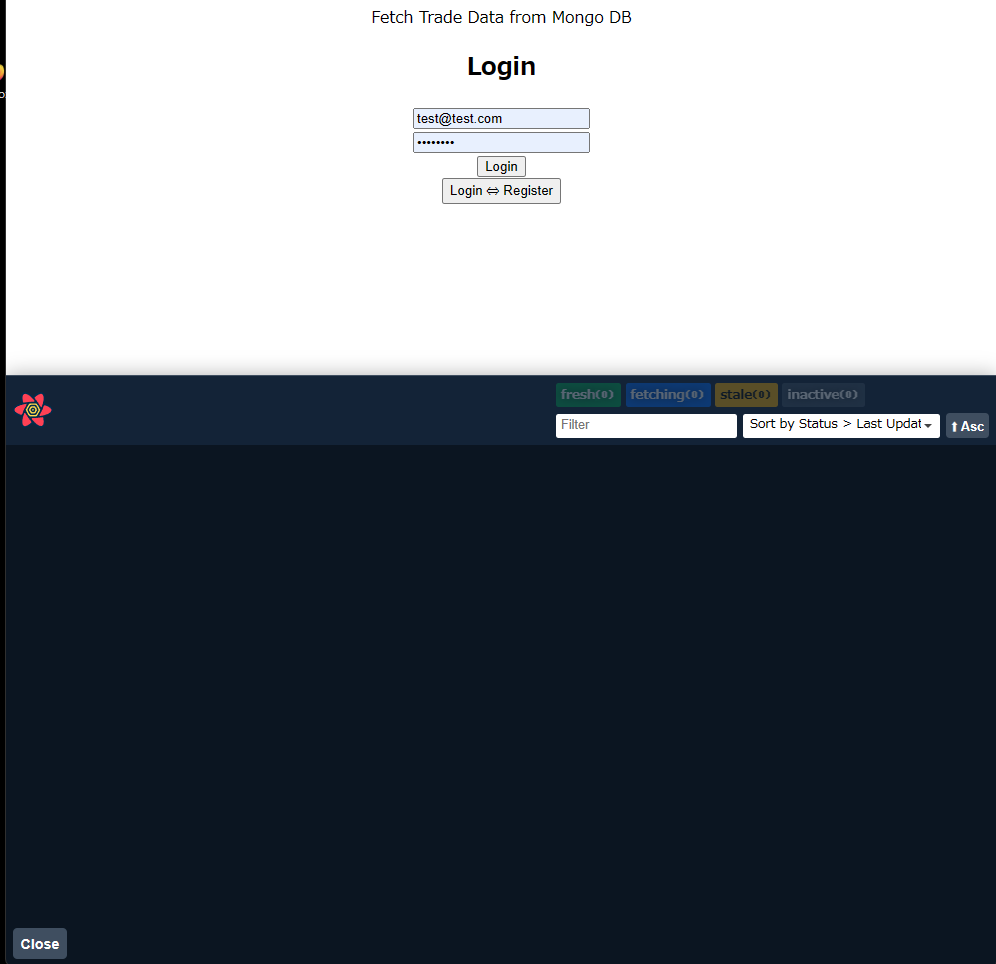
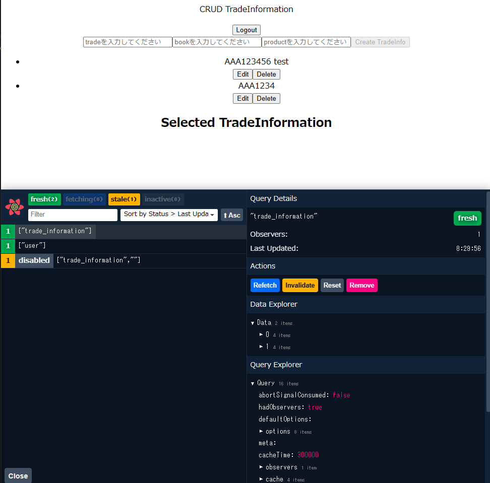
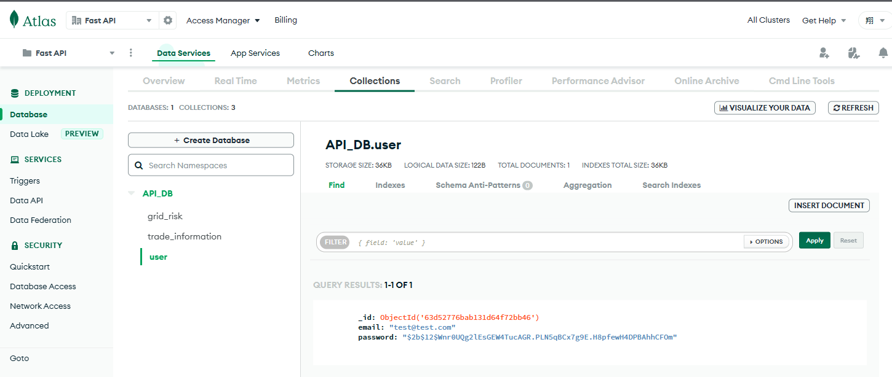
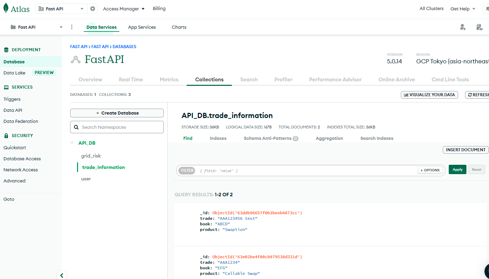

# mongodbとreduxを使ったCRUDの実装

バックエンド： mongodbを使用  
フロントエンド： redux、typescriptを使用

【フロントエンド】アプリケーション画面

ログイン実行後  
mongodbから取得したデータを表示し、編集ができるようになる。

【バックエンド】mongodb画面

user： user情報に関するデータが格納されている。  
trade_informationに： trade, book, productからなるデータが格納されている。

【詳細】
バックエンド
- JWTをCRSF Tokenを用いて、不正なアクセスが行われないようにしている。  
初めての実装だったため、こちらの
[ソース](https://github.com/aekasitt/fastapi-csrf-protect)
を参考にしている。